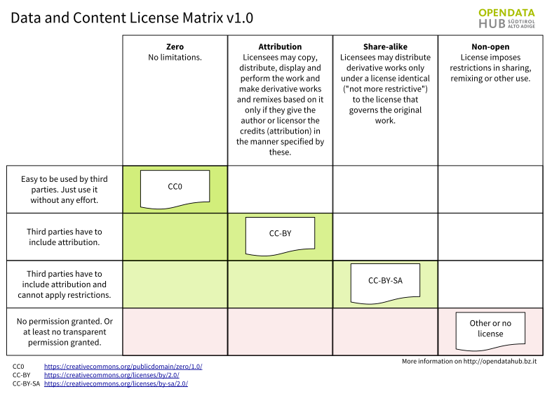

.. _available_datasets:

Domains and Datasets
====================

.. topic:: What is a Domain?

   .. include:: /includes/domains.rst

The goal of the Open Data Hub project is to make available datasets containing
data about the South Tyrolean ecosystem, to allow third parties to
develop novel applications on top of them, consuming the exposed
data. These applications may range from a simple processing of
datasets to extract statistical data and to display the result in
different graphic formats like pie-charts, to far more complex
applications that combine data from different datasets and correlate
them in some useful way.

As seen in :numref:`domains-diagram`, data originate from different
domains (Mobility, Tourism, and so on); they are gathered from sensors
and packed together by :ref:`data-providers`. `Sensors` can be for
example GPS devices installed on buses that send their real-time
geographic position or a small electronic device on a plug of an
e-charging station that checks the if the plug is being used or not,
to let people know that the charging outlet is available.

Datasets are accessible through a :term:`REST API`, the URL of each
endpoint is given along with other information in the description of
each dataset, see the lists of datasets in the remainder of this
section.

.. _data-providers:

Data Providers
--------------

A :strong:`Data Provider` is any entity that shares their Open Data
with the Open Data Hub project, allowing their free reuse (ideally
under a free licence like |cc0| or |bysa|). Data can be picked up by
any third-party to build their application. These entities can be
private companies or enterprises, public bodies, and even private
citizen.

The updated list of Data Providers that contribute to the Open Data
Hub is available on the Open Data Hub's home page:
https://opendatahub.com/community/

.. _datasets-license:

Datasets, Open Data, and Licenses
---------------------------------

The resources that are part of the |odh| Project are subject to
different licenses, which are described in section
:ref:`odh-license`. Derivative material built using |odh| material is
also subjected to different licenses, depending on its purpose, as
shown in :numref:`floss-lm`.

.. _floss-lm:

.. figure:: images/FLOSS-LM.png
   :scale: 70%
   :align: center

   Licenses for the |odh| and derivative material.

A large part of the Open Data Hub resources is represented by the
datasets. While some of datasets have been provided for testing
purposes or for internal use only, most of them are made of open Data
only.

The goal of the Open Data Hub project is to expose :strong:`only Open
Data` and the Open Data Hub team members always suggest to use a |CC0|
license to Data Providers releasing datasets, it is not yet possible
for the Open Data Hub team to guarantee the availability as Open Data
of all the data in the datasets, because the data licensing and its
distribution rights are decided by the copyright holder of each
dataset.

Since some of the datasets may contain data that can not be
distributed by the Open Data Hub team under an open licence like,
e.g., |cc0| or |bysa|, a user will be able to retrieve from each
dataset only those data that are distributed as :strong:`Open
Data`. The response to a query is in JSON format (although :term:`CSV`
output can be forced) and is :strong:`always` licensed as Open
Data. However, the response may include resources like links to web
pages, streams, or images that are subject to a different, even
proprietary, licence. For more information about this topic, there is
a :ref:`dedicated section <license-json-records>`.

The FLOSS four freedoms
~~~~~~~~~~~~~~~~~~~~~~~

The `four essential freedoms` are the four basic principle to which a
software program must comply to be defined free software. As stated on
the `What is free software?
<https://www.gnu.org/philosophy/free-sw.html>`_ web page (on which you
can find a lot more information and details), they are:

.. grid::

   .. grid-item-card:: Freedom 0
      :columns: 6
                
      The freedom to run the program as you wish, for any purpose
   
   .. grid-item-card:: Freedom 1
      :columns: 6

      The freedom to study how the program works, and change it so it
      does your computing as you wish. Access to the source code is a
      precondition for this.
  
   .. grid-item-card:: Freedom 2
      :columns: 6

      The freedom to redistribute copies of the program so you can
      help others.
                
   .. grid-item-card:: Freedom 3
      :columns: 6
                
      The freedom to distribute copies of your modified versions to
      others. By doing this you can give the whole community a chance
      to benefit from your changes. Access to the source code is a
      precondition for this.
  
.. _odh-license:

Licenses for |odh| resources
~~~~~~~~~~~~~~~~~~~~~~~~~~~~

The |odh| Project processes dataset, possibly supplied by third-party
sources (i.e., :ref:`data-providers`), which may contain closed data;
however, only Open Data are returned to the users' queries.

According to the main goal of the |odh| Project, we have defined
licenses for its different components and we use badges across the
documentation for a better visibility. As a rule of thumb, we try to
do our best to deliver :strong:`Open Data`, by developing
:strong:`Free/Open Source software` that is publicly available on
github, and by using an :strong:`Open Standard` for the API used to
access data.

These licenses are applied to the |odh| components:

* All the :strong:`software` released within the |odh| is Free software and
  complies with the GPLv3 license.  |gpl| Code repositories can be
  found at https://github.com/noi-techpark.
* The :strong:`Datasets` currently expose only Open Data that are in
  the public domain, so they are released as CC0. |cc0|
* The :strong:`APIs` have no license yet, since we are in the process to define
  which among the CC licenses could fit best. See :numref:`dac-lm` for
  an overview and quick description of CC licenses and derivative
  material.

CC0 Licensed Data
~~~~~~~~~~~~~~~~~

Open Data Hub provides a live updated table about the number of CC0
licensed data it contains. Please note, this data is calculated on
some datasets and does not consider all datasets of the whole Open
Data Hub yet.

https://databrowser.opendatahub.com/Home/LicenseStatus

.. note:: There is an additional clarification about the licence for
   any content that is retrieved from the datasets in JSON format,
   which is detailed in Section :ref:`license-json-records`.

.. _dac-lm:

   Creative Common Licenses and derivative material.

.. include:: /includes/json-license.rst

   
APIs Terms of Service
~~~~~~~~~~~~~~~~~~~~~

The |odh| project is already used in production for NOI internal
projects, and in particular it is the data hub used by the South
Tyrolean tourism portal, https://www.suedtirol.info/en/.

The public API are in early development and therefore should be still
considered as a :strong:`beta` version. If any third party would like
to use a stable version of the APIs in its production environment, a
special agreement must be signed with `NOI techpark
<https://noi.bz.it/en>`_. You can contact |contact| for any information.

Authentication
~~~~~~~~~~~~~~

The authentication layer is currently intended for :strong:`internal
use only`. All data in the dataset that you can receive from the Open Data Hub
are free to use and do not require any type of authentication.

The authentication layer can be of interest for developers who want to
collaborate in the development of Open Data Hub; Details on the implementation
are available in section :ref:`authentication-hub`.

.. _mobility-datasets:

.. _tourism-datasets:

.. _other-domains-datasets:

Datasets
--------

.. versionchanged:: 2022.06 API v1 for Mobility domain are no longer
   available.

.. versionchanged:: 2022.10 Removed information about datasets

The list of datasets and all the information associated with them have
been moved to the |odh| main web site with the same categorisation,
hence you can find them in the following pages:

* :home:`Mobility / Mobility <mobility>` datasets
* :home:`Mobility / Traffic <traffic>` datasets
* :home:`Tourism <tourism>` datasets
* :home:`Other <others>` datasets.

To access the dataset, please refer to the
:doc:`/howto/mobility/getstarted` and :doc:`/howto/tourism/getstarted`
howtos, which helps you getting started in retrieving data from the
Mobility and Tourism datasets, and to the other howtos are available
in the :ref:`dedicated section <howto-list>`.

:ref:`mobility-tech` and :ref:`tourism-tech` are still available in
this documentation portal.

.. toctree::
   :hidden:

   mobility-tech
   tourism-tech
