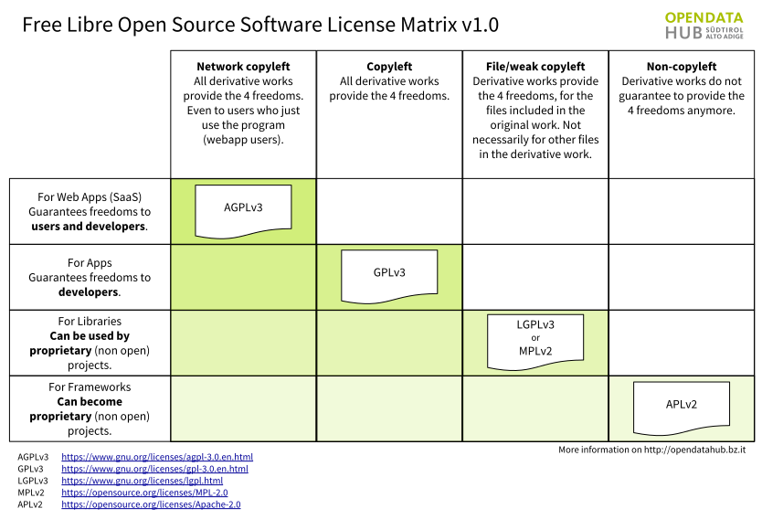
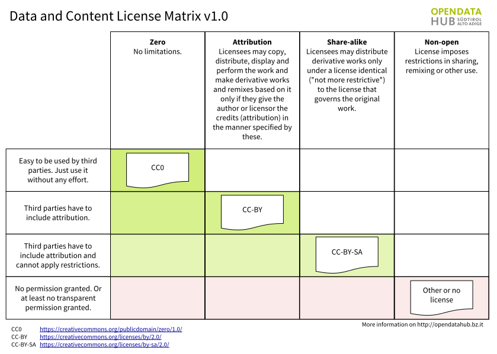

Licenses and TOS for the |odh| material
=======================================

The resources that are part of the |odh| Project are subject to
different licenses, which are described in section
:ref:`odh-license`\. Derivative material built using |odh| material is
also subjected to different licenses, depending on its purpose, as
shown in :numref:`floss-lm`.

.. _floss-lm:

   Licenses for the |odh| and derivative material.

The FLOSS four freedoms
-----------------------

The `four essential freedoms` are the four basic principle to which a
software program must comply to be defined free software. As stated on
the `What is free software?
<https://www.gnu.org/philosophy/free-sw.html>`_ web page (on which you
can find a lot more information and details), they are:

* The freedom to run the program as you wish, for any purpose
  (:strong:`freedom 0`).
* The freedom to study how the program works, and change it so it does
  your computing as you wish (:strong:`freedom 1`).. Access to the
  source code is a precondition for this.
* The freedom to redistribute copies so you can help others
  (:strong:`freedom 2`).
* The freedom to distribute copies of your modified versions to others
  (:strong:`freedom 3`). By doing this you can give the whole
  community a chance to benefit from your changes. Access to the
  source code is a precondition for this.

.. _odh-license:

Licenses for |odh| resources
----------------------------

According to the main goal of the |odh| Project, we have defined
licenses for its different components and we use badges across the
documentation for a better visibility. As a rule of thumb, we try to
do our best to deliver Open Data by developing Free/Open Source
software and by using an Open Standard for the API used to access
data.

The Open Data Hub Project exposes data, possibly of third-party
sources. Without the use of authentication, only Open Data are
returned. These licenses are applied to the |odh| components:

* All the software released within the |odh| is Free software and
  complies with the GPLv3 license.  |gpl|
* Datasets currently expose only open data that are in the public
  domain, so they are released as CC0. |cc0|
* APIs have no license yet, since we are in the process to define
  which among the CC licenses could fit best. See :numref:`dac-lm` for
  an overview and quick description of CC licenses and derivative
  material.

 
.. _dac-lm:

   Creative Common Licenses and derivative material. 
  
APIs Terms of Service
---------------------

The |odh| project is already used in production for IDM internal
projects, and in particular it is the data hub used by the South
Tyrolean tourism portal www.suedtirol.info.

The public API are in early development and therefore should be still
considered as a :strong:`beta` version. If any third party would like
to use a stable version of the APIs in its production environment, a
special agreement must be signed with `IDM Südtirol - Alto Adige
<https://www.idm-suedtirol.com/>`_. You can contact
|contact| for any information.

..
   Each API is provided AS-IS, with no expressed or implied
   warranties. In no event shall the author be liable for any special,
   direct, indirect, or consequential damages or any damages whatsoever
   resulting from loss of use, data or profits, whether in an action of
   contract, negligence or other tortious action, arising out of or in
   connection with the use or performance of this software.
